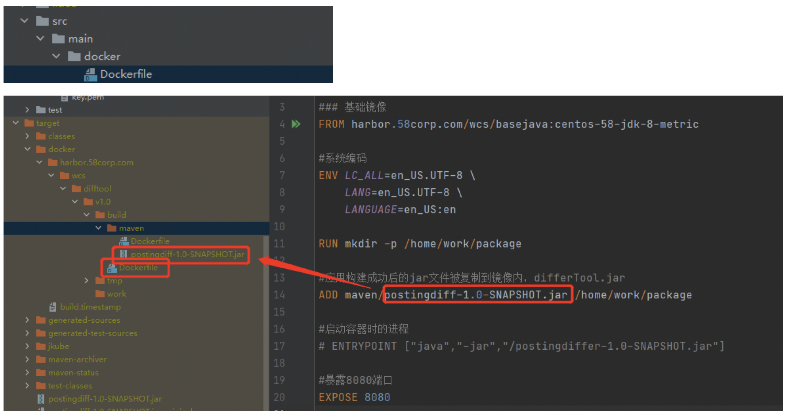

# 采用JKube插件实现项目的自动化部署

相关链接： https://www.eclipse.org/jkube/docs/kubernetes-maven-plugin

## 执行命令：

```bash
mvn clean package k8s:build

mvn -Djkube.docker.username=jolokia -Djkube.docker.password=s!cr!t k8s:push

mvn  k8s:apply

mvn clean package k8s:build -Djkube.docker.username=jolokia -Djkube.docker.password=s!cr!t k8s:push k8s:apply k8s:log
```

## 相关配置

### pom配置

> 注意：
>
> 1. kubenets的证书编码问题
> 2. 有关ip访问等注意添加 http / https

```XML
       <properties>
           <java.version>1.8</java.version>
           <jkube.docker.registry>http://harbor.58corp.com/</jkube.docker.registry>
       </properties>
   
       <build>
           <plugins>
               <plugin>
                   <groupId>org.eclipse.jkube</groupId>
                   <artifactId>kubernetes-maven-plugin</artifactId>
                   <version>1.0.2</version>
                   <configuration>
                       <resources>
                           <secrets>
                               <secret>
                                   <dockerServerId>${jkube.docker.registry}</dockerServerId>
                                   <name>mydockerkey</name>
                               </secret>
                           </secrets>
                       </resources>
   <!--                    用于在执行Docker构建时打开诸如构建步骤之类的详细输出。-->
                       <verbose>true</verbose>
   <!--                    日志标准输出，无论是否配置了日志文件-->
                       <logStdout>true</logStdout>
                       <!--kubenets访问配置-->
                       <access>
                        <namespace>wcs-online</namespace>
                           <masterUrl>https://10.126.xx.xx:8123/</masterUrl>
                           <apiVersion>v1</apiVersion>
                           <!-- SSL证书 ca cert key .pem-->
                           <caCertFile>${project.basedir}\src\main\resources\ca.pem</caCertFile>
                           <clientCertFile>${project.basedir}\src\main\resources\cert.pem</clientCertFile>
                           <clientKeyFile>${project.basedir}\src\main\resources\key.pem</clientKeyFile>
   
                       </access>
   
                       <dockerHost>tcp://10.136.xx.xx:2375</dockerHost>
                       <images>
                           <!-- A single's image configuration -->
                           <image>
                               <name>harbor.58corp.com/wcs/difftool:v1.0</name>
                               <alias>difftool</alias>
                               <registry>http://harbor.58corp.com/</registry>
                               <build>
                                   <dockerFile>${project.basedir}/src/main/docker/Dockerfile</dockerFile>
                               </build>
                           </image>
                       </images>
                   </configuration>
   
                   <!-- Connect k8s:resource, k8s:build and k8s:apply to lifecycle phases -->
                   <executions>
                       <execution>
                           <id>jkube</id>
                           <goals>
                               <goal>resource</goal>
                               <goal>build</goal>
                               <goal>apply</goal>
                           </goals>
                       </execution>
                   </executions>
               </plugin>
           </plugins>
       </build>
```

### Dockerfile



### kubenet 相关yml配置文件


#### service.yml

```yml
metadata:
  name: difftool
  namespace: wcs-online
  labels:
    name: difftool
spec:
  type: NodePort
  ports:
    - port: 8089
      targetPort: 8089
      protocol: TCP
      nodePort: 31887
  selector:
    name: difftool
```

#### deployment.yml

```yml
spec:
  replicas: 1
  selector:
    matchLabels:
      name: difftool
      version: v1.0
  strategy:
    rollingUpdate:
      maxSurge: 1
      maxUnavailable: 0
    type: RollingUpdate
  template:
    metadata:
      labels:
        name: difftool
        version: v1.0
        role: difftool
    spec:
      containers:
        - name: difftool-k8s
          image: harbor.58corp.com/wcs/difftool:v1.0
          imagePullPolicy: Always
          command: ["java","-jar","postingdiff-1.0-SNAPSHOT.jar"]
          ports:
            - name: differtool-k8s
              containerPort: 8089
          workingDir: /home/work/package
```

# 