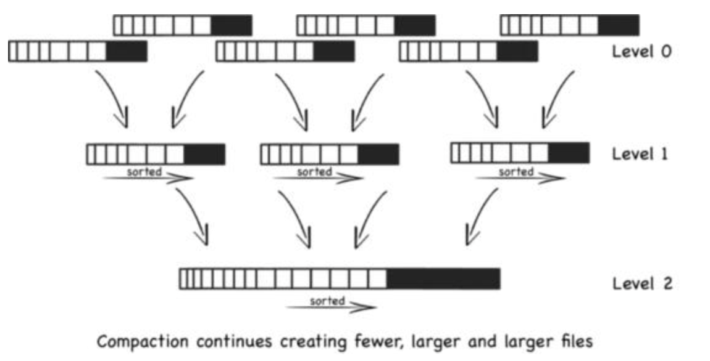
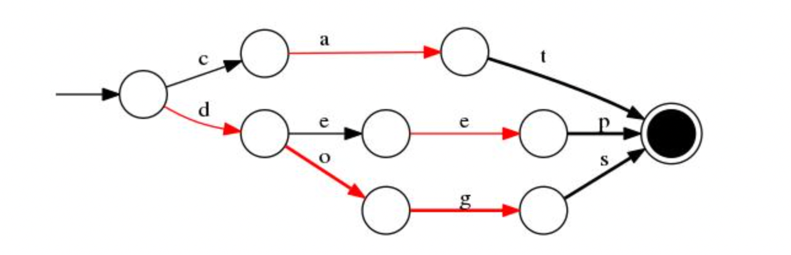
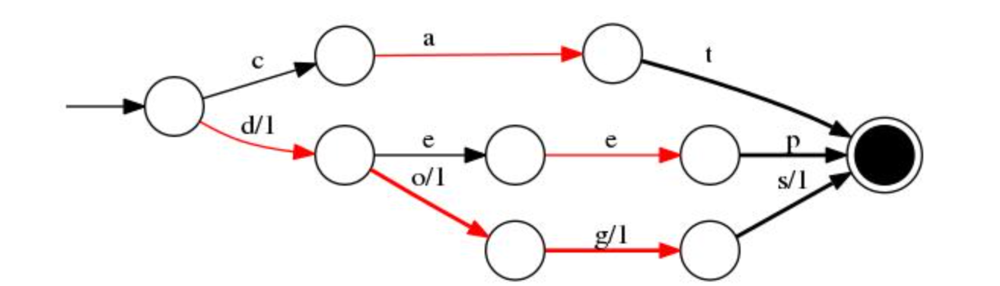
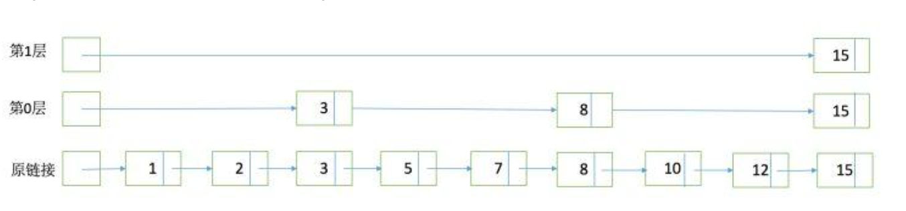
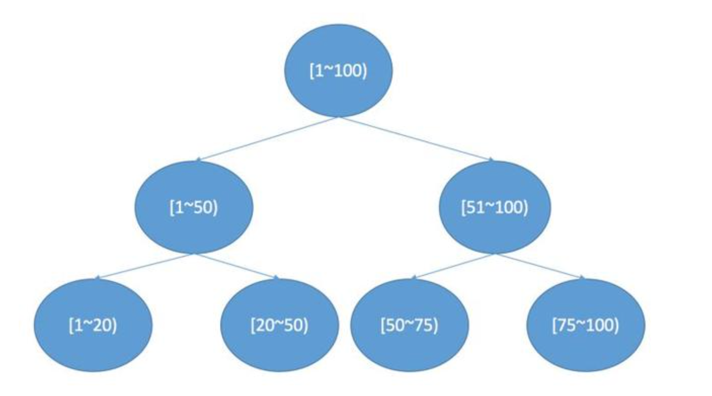
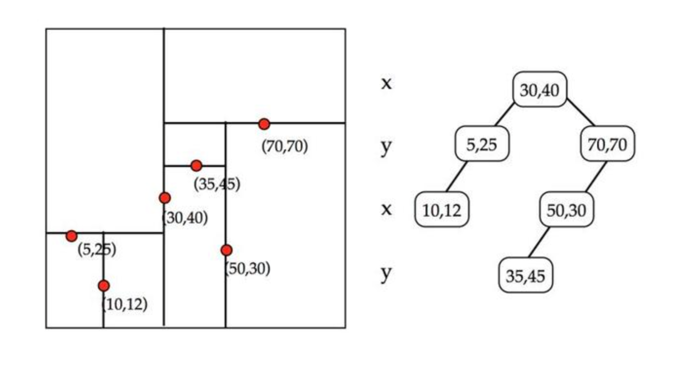

# 搜索引擎的极致优化——思想以及相关的数据结构

LSM (Log Structured Merge Tree)，最早是谷歌的 “BigTable” 提出来的，目标是保证写入性能，同时又能支持较高效率的检索，在很多 NoSQL 中都有使用，Lucene 也是使用 LSM 思想来写入。

普通的B+树增加记录可能需要执行 seek+update 操作，这需要大量磁盘寻道移动磁头。而 LSM 采用记录在文件末尾，顺序写入减少移动磁头/寻道，执行效率高于 B+树。具体 LSM 的原理是什么呢？

为了保持磁盘的IO效率，lucene避免对索引文件的直接修改，所有的索引文件一旦生成，就是只读，不能被改变的。其操作过程如下：

1. 在内存中保存新增的索引, 内存缓存（也就是memtable）;
2. 内存中的索引数量达到一定阈值时，触发写操作，将这部分数据批量写入新文件，我们称为segment；也就是 sstable文件
3. 新增的segment生成后，不能被修改；
4. update操作和delete操作不会立即导致原有的数据被修改或者删除，会以append的方式存储update和delete标记;
5. 最终得到大量的 segment，为了减少资源占用，也提高检索效率，会定期的将这些小的 segment 合并成大的 segment，由于map中的数据都是排好序的，所以合并也不会有随机写操作；
6. 通过merge，还可以把update和delete操作真正生效，删除多余的数据，节省空间。

合并的过程：

**Basic Compaction**

每个文件固定N个数量，超过N，则新建一个sstable；当sstable数大于M，则合并一个大sstable；当大sstable的数量大于M，则合并一个更大的sstable文件，依次类推。

但是，这会出现一个问题，就是大量的文件被创建，在最坏的情况下，所有的文件都要搜索。

**Levelled Compaction**

像 LevelDB 和 Cassandra解决这个问题的方法是：实现了一个分层的，而不是根据文件大小来执行合并操作。

1. 每层维护指定数量的文件，保证不让 key 重叠，查找一个 key 只会查找一个 key；
2. 每次文件只会被合并到上一层的一个文件。当一层的文件数满足特定个数时，合并到上一层。

所以， LSM 是日志和传统的单文件索引（B+ tree，Hash Index）的中立，他提供一个机制来管理更小的独立的索引文件(sstable)。

通过管理一组索引文件而不是单一的索引文件，LSM 将B+树等结构昂贵的随机IO变的更快，而代价就是读操作要处理大量的索引文件(sstable)而不是一个，另外还是一些IO被合并操作消耗。

Lucene的Segment设计思想，与LSM类似但又有些不同，继承了LSM中数据写入的优点，但是在查询上只能提供近实时而非实时查询。

Segment在被flush或commit之前，数据保存在内存中，是不可被搜索的，这也就是为什么Lucene被称为提供近实时而非实时查询的原因。读了它的代码后，发现它并不是不能实现数据写入即可查，只是实现起来比较复杂。原因是Lucene中数据搜索依赖构建的索引（例如倒排依赖Term Dictionary），Lucene中对数据索引的构建会在Segment flush时，而非实时构建，目的是为了构建最高效索引。当然它可引入另外一套索引机制，在数据实时写入时即构建，但这套索引实现会与当前Segment内索引不同，需要引入额外的写入时索引以及另外一套查询机制，有一定复杂度。

## **FST**

数据字典 Term Dictionary，通常要从数据字典找到指定的词的方法是：将所有词排序，用二分查找即可。这种方式的时间复杂度是 Log(N)，占用空间大小是 O(N*len(term))。缺点是消耗内存，存在完整的term，当 term 数达到上千万时，占用内存非常大。

lucene从4开始大量使用的数据结构是FST（Finite State Transducer，有限状态转换机）。FST有两个优点：

1. 空间占用小，通过读 term 拆分复用及前缀和后缀的重用，压缩了存储空间；
2. 查询速度快，查询仅有 O(len(term)) 时间复杂度

那么 FST 数据结构是什么原理呢？ 先来看看什么是 FSM (Finite State Machine，有限状态机)，从“起始状态”到“终止状态”，可接受一个字符后，自循环或转移到下一个状态。

而FST呢，就是一种特殊的 FSM，在 Lucene 中用来实现字典查找功能(NLP中还可以做转换功能)，FST 可以表示成FST的形式

举例：对“cat”、 “deep”、 “do”、 “dog” 、“dogs” 这5个单词构建FST（注：必须已排序），结构如下：

当存在 value 为对应的 docId 时，如 cat/0 deep/1 do/2 dog/3 dogs/4， FST 结构图如下：

FST 还有一个特点，就是在前缀公用的基础上，还会做一个后缀公用，目标同样是为了压缩存储空间。

其中红色的弧线表 NEXT-optimized，可以通过 画图工具 来测试。

## SkipList（用于倒排链的合并）

为了能够快速查找docid，lucene采用了SkipList这一数据结构。SkipList有以下几个特征：

1. 元素排序的，对应到我们的倒排链，lucene是按照docid进行排序，从小到大;
2. 跳跃有一个固定的间隔，这个是需要建立SkipList的时候指定好，例如下图以间隔是;
3. SkipList的层次，这个是指整个SkipList有几层

在什么位置设置跳表指针？

· 设置较多的指针，较短的步长， 更多的跳跃机会

· 更多的指针比较次数和更多的存储空间

· 设置较少的指针，较少的指针比较次数，但是需要设置较长的步长较少的连续跳跃

如果倒排表的长度是L，那么在每隔一个步长S处均匀放置跳表指针。

## **BKD Tree**

也叫 Block KD-tree，根据FST思路，如果查询条件非常多，需要对每个条件根据 FST 查出结果，进行求并集操作。如果是数值类型，那么潜在的 Term 可能非常多，查询销量也会很低，为了支持高效的数值类或者多维度查询，引入 BKD Tree。在一维下就是一棵二叉搜索树，在二维下是如果要查询一个区间，logN的复杂度就可以访问到叶子节点对应的倒排链。

1. 确定切分维度，这里维度的选取顺序是数据在这个维度方法最大的维度优先。一个直接的理解就是，数据分散越开的维度，我们优先切分。
2. 切分点的选这个维度最中间的点。
3. 递归进行步骤1，2，我们可以设置一个阈值，点的数目少于多少后就不再切分，直到所有的点都切分好停止。

## **BitSet 过滤**

二进制处理，通过BKD-Tree查找到的docID是无序的，所以要么先转成有序的docID数组，或者构造BitSet，然后再与其他结果合并。

## **IndexSorting**

IndexSorting是一种预排序，在ES6.0之后才有，与查询时的Sort不同，IndexSorting是一种预排序，即数据预先按照某种方式进行排序，它是Index的一个设置，不可更改。

一个Segment中的每个文档，都会被分配一个docID，docID从0开始，顺序分配。在没有IndexSorting时，docID是按照文档写入的顺序进行分配的，在设置了IndexSorting之后，docID的顺序就与IndexSorting的顺序一致。

举个例子来说，假如文档中有一列为Timestamp，我们在IndexSorting中设置按照Timestamp逆序排序，那么在一个Segment内，docID越小，对应的文档的Timestamp越大，即按照Timestamp从大到小的顺序分配docID。

IndexSorting 之所以可以优化性能，是因为可以提前中断以及提高数据压缩率，但是他并不能满足所有的场景，比如使用非预排序字段排序，还会损耗写入时的性能。

搜索引擎正是靠优秀的理论加极致的优化，做到查询性能上的极致，后续会再结合源码分析压缩算法如何做到极致的性能优化的。

# 倒排索引查询原理

* https://www.pianshen.com/article/9815408284/

# BM25 和 BM25F 模型

* https://www.cnblogs.com/tlnshuju/archive/2017/04/18/6730403.html
* https://zhuanlan.zhihu.com/p/31009310