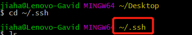
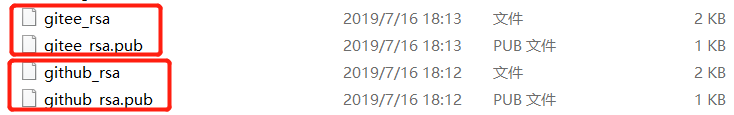

@[TOC](Git clone ssh协议配置Igit&Github&Gitee等)
> 最近由于频繁使用git从Github、Gitee(码云)等代码仓库clone别人的优秀code，但是发现从Github上clone完项目后，想要再从Gitee上clone项目就必须重新配置ssh-key。这样来回生成ssh-key然后还得配置也太麻烦了，接下来，本文章会介绍如何解决这种问题。
## 

# Git中https和SSH的clone方式区别

* HTTPS：
  * 不管是谁，拿到url随便clone，但是在push的时候需要验证用户名和密码；

  * 一旦用户改了oa密码本地凭证也需要跟着调整；

  * 所支持的最大单次推包大小有限制，若超过限制，需使用SSH方式

* SSH：
  * clone的项目你必须是拥有者或者管理员，而且需要在clone前添加SSH Key；
  * SSH 在push的时候，是不需要输入用户名的，如果配置SSH key的时候设置了密码，则需要输入密码的，否则直接是不需要输入密码的；
  * 上传代码没有大小限制


# Git http转ssh命令

```bash
git remote remove origin  # 取消关联
git remote add origin git@xxxxxx.git # 设置新关联
git remote -v # 查看本地配置的链接方式
```

# Git clone ssh协议本地设置

#### 1. ssh文件本地环境配置
* 在自己系统中找到 ==.ssh==文件夹,**将此目录下的文件全部删除**。
	* 方法一： 在GUI模式下手动寻找 （window系统在 “C:\Users\账号名\\.ssh ” ）
	  
	
	* 方法二： 鼠标右键打开 Git Bash，在弹出的窗口中输入：
	
	  ```bash
    cd ~/.ssh       # 进入.ssh文件夹
    ```
    


 * 生成ssh配置文件【 [此处可参阅GitHub官方文档](https://docs.github.com/zh/authentication/connecting-to-github-with-ssh/generating-a-new-ssh-key-and-adding-it-to-the-ssh-agent) 】（注意：是在.ssh 文件夹下）


      * macOS 13版本以下可以使用以下方法进行配置
        
        ```bash
        ssh-keygen -t rsa -C "[邮箱账号]" -b 4096
        ```
        
      * macOS 13及以上版本需使用以下方法进行配置
        
        ```bash
        ssh-keygen -t ed25519 -C "[邮箱账号]"
        ```
        
      * 上述命令的执行次数由你要绑定几个代码仓库有关（eg: 要同时绑定Github和Gitee，则上述命令需执行两次），执行的时候可以自己指定生成文件的文件名（默认是id_rsa），然后填写密码（可以为空）：
        
        ```bash
        Generating public/private rsa key pair.
        Enter file in which to save the key (C:/Users/jiaha/.ssh): github_rsa
        ```
        
        


  * Git 全局配置设置

    ```bash
    git config --global user.name "[提交用户名(igit强制规定为OA账号)]"
    git config --global user.email "[提交用户邮箱(igit强制规定为OA邮箱)]"
    ```

 * 创建config文件，写入一些相应配置

```bash
# 全局配置
ServerAliveInterval 60
AddKeysToAgent yes

# 58 igit
Host igit.58corp.com
    ControlMaster auto
    ControlPersist yes
    UseKeychain yes
    IdentityFile ~/.ssh/id_ed25519

# github
Host github.com
  HostName github.com
  User git
  IdentityFile ~/.ssh/id_ed25519

# gitee
Host gitee.com
  HostName gitee.com
  PreferredAuthentications publickey
  IdentityFile ~/.ssh/id_rsa.gitee
```
#### 2. 在Github、Gitee上配置SSH keys（以Github为例）
* 登录自己的Github / Gitee 网站，点击网站右上角自己的头像， 点击 Settings 选项，打开如下窗口，点击"New SSH key"。

* “文本框1”中可以自己填写一个自定义标识（可以随便填写），“文本框2”中将之前在本地生成的**_rsa.pub文件中的内容复制粘贴到这里即可。然后点击“Add SSH key”。
	
#### 3.测试是否成功
* 打开 git 的控制窗口，输入如下命令：
	```console
	# 测试连接 Github 
	ssh -T git@github.com
	# 测试连接 Gitee 
	ssh -T git@gitee.com
	# 测试链接igit.58corp 返回会有你本地sshkey绑定的账号 用户
	ssh -T git@igit.58corp.com 
	```
* 如果出现如下结果，则说明你已经配置成功了。
	


# 参考文献

https://blog.csdn.net/qq_33858250/article/details/81046316
https://my.oschina.net/u/3552749/blog/1678082
