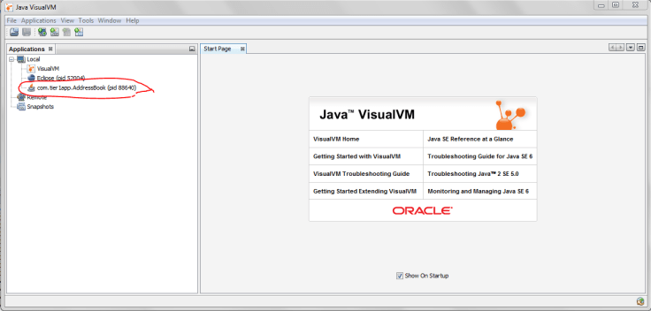
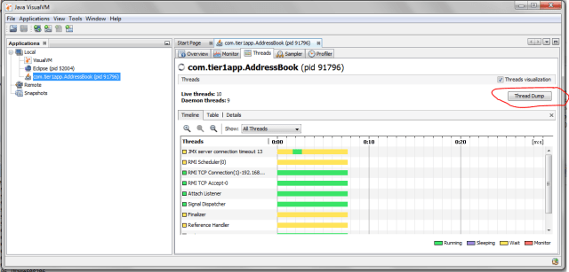
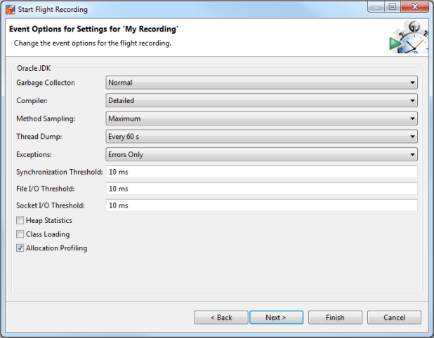
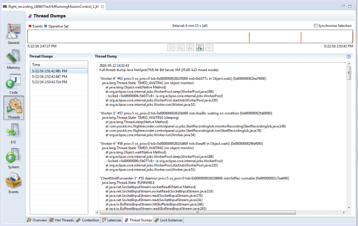
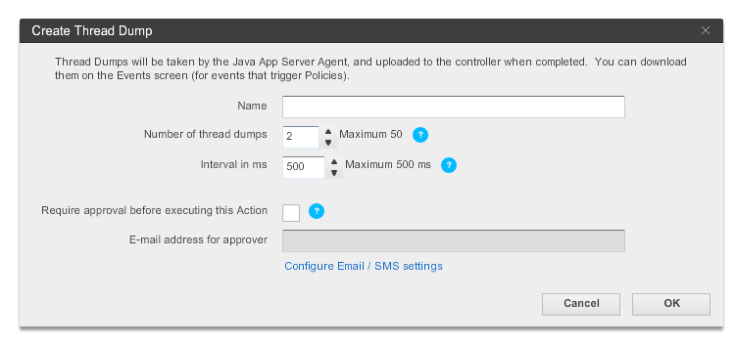

- [fastthread.io](http://fastthread.io/) JVM Thread dump分析

## [HOW TO TAKE THREAD DUMPS? – 8 OPTIONS](https://blog.fastthread.io/2016/06/06/how-to-take-thread-dumps-7-options/)

thread dump是诊断 CPU 峰值、死锁、响应时间差、内存问题、无响应应用程序和其他系统问题的重要工具。有一些很棒的在线JVM Thread dump分析工具，例如http://fastthread.io/，可以分析和发现问题。但对于这些工具，您需要提供适当的thread dump作为输入。因此，在本文中，我记录了 8 个不同的选项来捕获thread dump。

### 1. jstack

“jstack”是捕获thread dump的有效命令行工具。jstack 工具位于 JDK_HOME/bin 文件夹中。以下是捕获thread dump所需发出的命令：

```
jstack -l   <pid> > <文件路径>
```

pid：是应用程序的进程 ID，应捕获其thread dump

file-path：是将写入thread dump的文件路径。

例子：

```
jstack -l  37320 > /opt/tmp/threadDump.txt
```

根据示例，进程的thread dump将在 /opt/tmp/threadDump.txt 文件中生成。

Jstack 工具从 Java 5 开始就包含在 JDK 中。如果您运行在旧版本的 java 中，请考虑使用其他选项

### 2.kill -3

在大型企业中，出于安全原因，仅在生产计算机上安装 JRE。由于jstack和其他工具只是JDK的一部分，因此您将无法使用jstack工具。在这种情况下，可以使用“kill -3”选项。

```
kill -3 <pid>
```

在哪里

pid：是应用程序的进程 ID，应捕获其thread dump

例子：

```
kill -3  37320
```

当使用“kill -3”选项时，thread dump将发送到标准错误流。如果您在 tomcat 中运行应用程序，thread dump将被发送到 <TOMCAT_HOME>/logs/catalina.out 文件中。

注意：据我所知，大多数 unix 操作系统（Unix、Linux、HP-UX 操作系统）都支持此选项。不确定其他操作系统。

### 3.JVisualVM

Java VisualVM 是一个图形用户界面工具，当应用程序在指定的 Java 虚拟机 (JVM) 上运行时，它提供有关应用程序的详细信息。它位于 JDK_HOME/bin/jvisualvm.exe 中。自 JDK 6 更新 7.s 起，它就成为 Sun JDK 发行版的一部分

启动 jvisualvm。在左侧面板上，您会注意到计算机上运行的所有 Java 应用程序。您需要从列表中选择您的应用程序（请参见下图中的红色突出显示）。该工具还能够从远程主机上运行的 java 进程捕获thread dump。

##### 

##### *图：Java 可视化虚拟机*

现在转到“线程”选项卡。单击“thread dump”按钮，如下图所示。现在将生成thread dump。

##### 

##### *图：突出显示“Threads”选项卡中的“Thread Dump”按钮*

### 4、JMC

Java Mission Control (JMC) 是一种从本地运行或部署在生产环境中的 Java 应用程序收集和分析数据的工具。自 Oracle JDK 7 Update 40 起，该工具已打包到 JDK 中。该工具还提供了从 JVM 获取thread dump的选项。JMC 工具存在于*JDK_HOMEbinjmc.exe中*

启动该工具后，您将看到本地主机上运行的所有 Java 进程。注意：JMC 还可以连接远程主机上运行的 java 进程。现在，在左侧面板上，单击要获取thread dump的 Java 进程下方列出的“Flight Recorder”选项。现在您将看到“开始飞行记录”向导，如下图所示。

##### 

##### *图：飞行记录器向导显示“thread dump”捕获选项。*

在“Thread Dump”字段中，您可以选择要捕获thread dump的时间间隔。根据上面的示例，每 60 秒就会捕获一次thread dump。选择完成后启动飞行记录器。录制完成后，您将在“Threads”面板中看到thread dump，如下图所示。

##### 

##### *图：显示 JMC 中捕获的“thread dump”。*

### 5. Windows（Ctrl + Break）

此选项仅适用于 Windows 操作系统。

- 选择已启动应用程序的命令行控制台窗口。
- 现在在控制台窗口中发出“ **Ctrl + Break** ”命令。

这将生成thread dump。thread dump将打印在控制台窗口本身上。

**注1**：在一些笔记本电脑（例如我的联想T系列）中，“Break”键已被删除。在这种情况下，您必须通过谷歌搜索来找到“Break”的等效键。就我而言，“功能键 + B”相当于“Break”键。因此我必须使用“Ctrl + Fn + B”来生成thread dump。

**注 2：**但该方法的一个缺点是thread dump将打印在 Windows 控制台本身上。如果没有以文件格式获取thread dump，则很难使用[http://fastthread.io](http://fastthread.io/)等JVM Thread dump分析工具。因此，当您从命令行启动应用程序时，将输出重定向到文本文件，例如，如果您要启动应用程序“SampleThreadProgram”，您将发出以下命令：

```
java -classpath . SampleThreadProgram
```

相反，像这样启动 SampleThreadProgram

```
java -classpath . SampleThreadProgram > C:workspacethreadDump.txt 2>&1
```

因此，当您发出“Ctrl + Break”时，thread dump将被发送到**C:workspacethreadDump.txt**文件。

### 6.ThreadMXBean

从 JDK 1.5 开始引入 ThreadMXBean。这是Java虚拟机中线程系统的管理接口。使用此接口还可以生成thread dump。您只需编写几行代码即可以编程方式生成thread dump。下面是 ThreadMXBean 实现的框架实现，它从应用程序生成thread dump。

```
 public void  dumpThreadDump() {
        ThreadMXBean threadMxBean = ManagementFactory.getThreadMXBean();
        for (ThreadInfo ti : threadMxBean.dumpAllThreads(true, true)) {
            System.out.print(ti.toString());
        }
    }
```

### 7.APM工具——应用动态

很少有应用程序性能监控工具提供生成thread dump的选项。如果您通过 App Dynamics（APM 工具）监控您的应用程序，以下是捕获thread dump的说明：

1. 创建一个操作，在“创建操作”窗口中选择**“诊断”->“进行thread dump” 。**
2. 输入操作的名称、要获取的样本数以及thread dump之间的时间间隔（以毫秒为单位）。
3. 如果您希望在启动thread dump操作之前需要批准，请选中在此操作之前需要批准复选框，并输入有权批准该操作的个人或组的电子邮件地址。有关详细信息，请参阅需要批准的操作。
4. 单击**“确定”**。

##### 

##### *图：应用程序动态thread dump捕获向导*

### 8. JCMD

jcmd 工具是在 Oracle 的 Java 7 中引入的。它对于解决 JVM 应用程序的问题非常有用。它具有各种功能，例如识别 java 进程 ID、获取堆转储、获取thread dump、获取垃圾收集统计信息等。

使用下面的 JCMD 命令可以生成thread dump：

```
jcmd <pid> Thread.print > <file-path>
```

**pid：**是应用程序的进程 ID，应捕获其thread dump

**file-path：**是将写入thread dump的文件路径。

例子：

```
jcmd 37320 Thread.print > /opt/tmp/threadDump.txt
```

根据示例，进程的thread dump将在 /opt/tmp/threadDump.txt 文件中生成。

### 结论

尽管列出了 8 个不同的选项来捕获thread dump，但恕我直言，1.“jstack”和 2.“kill -3”和 8.“jcmd”是最好的选项。因为他们是：

A。简单（简单明了，易于实现）

b. 通用（在大多数情况下都适用，无论操作系统、Java 供应商、JVM 版本如何……）
