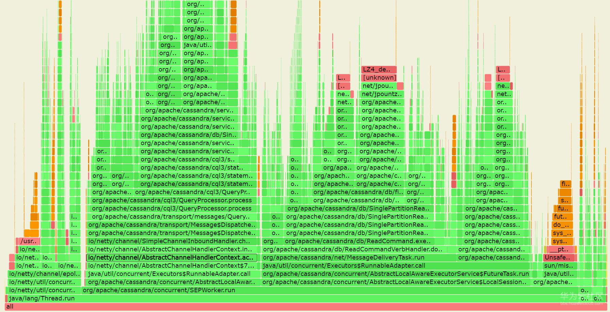
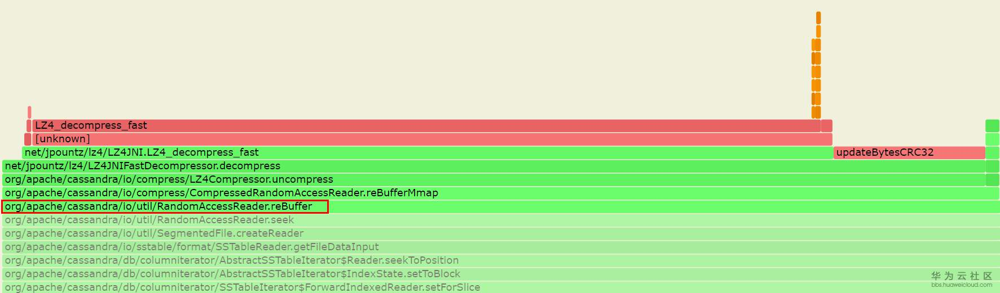

# JAVA看火焰图热点函数async-profiler工具介绍及经验分享

> async-profiler工具是非常好用采集java函数调用栈的工具，重要的是开源的，可以随便拿过来折腾随便玩。

## 使用流程：

1. 下载：去github，最新版本就行了：（可以直接使用本目录文件夹下的包，可跳过编译过程）

   git clone https://github.com/jvm-profiling-tools/async-profiler

2. 然后就开始编译了，执行make就行了，注意服务器上要安装gcc编译器

   make

3. 中间过程如果出现没有安装的组件，安装完以后再重新编译就行了。不过，async-profiler编译一般不会遇到什么问题，建议每次使用的时候重新编译一下，免得出现兼容性问题，毕竟make还是很快的。

4. OK，编译好了，就直接用就是了，执行：

   ./profile.sh

   显示帮助信息。看下example就可以了，常用的都在example里面。

5. 我们一般用 `./profiler.sh -d 60 --cstack dwarf -f 2449-alloc.html -o flamegraph 3456` 这个就行了。-d 表示采样时间多少秒。`--cstack`用于指定性能分析的方式，`dwarf`是一种调试信息格式，用于在分析时获取堆栈信息。 -f是输出到文件，3456是被采样java进程id。

   这里对输出文件，建议命名为XXXX.svg/xxx.html，这个直接可以在浏览器打开，看到火焰图。这也是比较喜欢async-profiler原因之一，不需要再次调用工具生成火焰图。

svg文件直接用浏览器打开（推荐chrome）下面是生成的火焰图：

## 技巧：

1. 双击当前函数可以看到单独以此函数为底的火焰图展开，可以聚焦分析某个函数。怎么看热点耗时多函数，大家都会不用多讲。

2. 对同一个程序运行在不同服务器上进行采样，可以对比出调用差异和性能。

调用差异一般是看同一底函数上面长出不同的分支调用。

对比性能就看同一个函数的采样次数和百分比，注意不一定准确，但是如果大部分函数的变化规律一致的话，就具有参考意义。

好吧，这样去用就是了，很简单的一个工具。