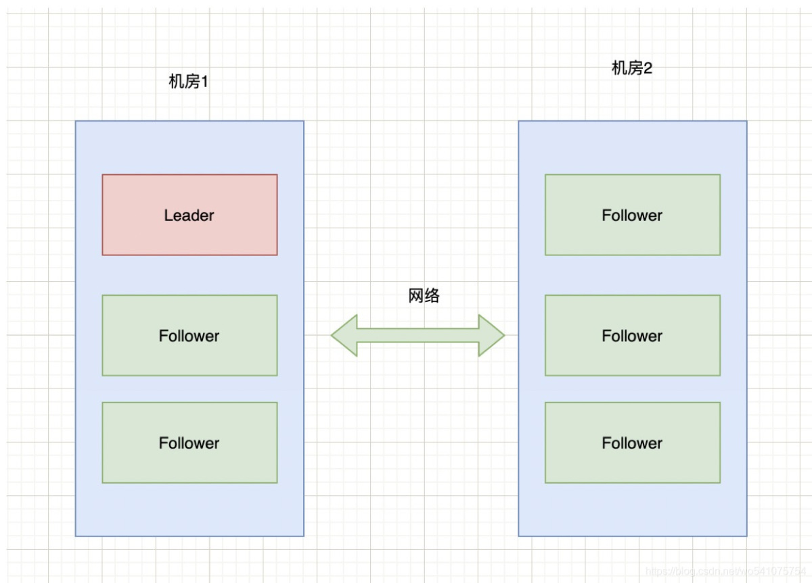
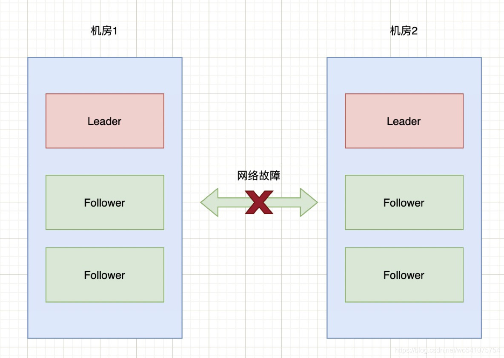
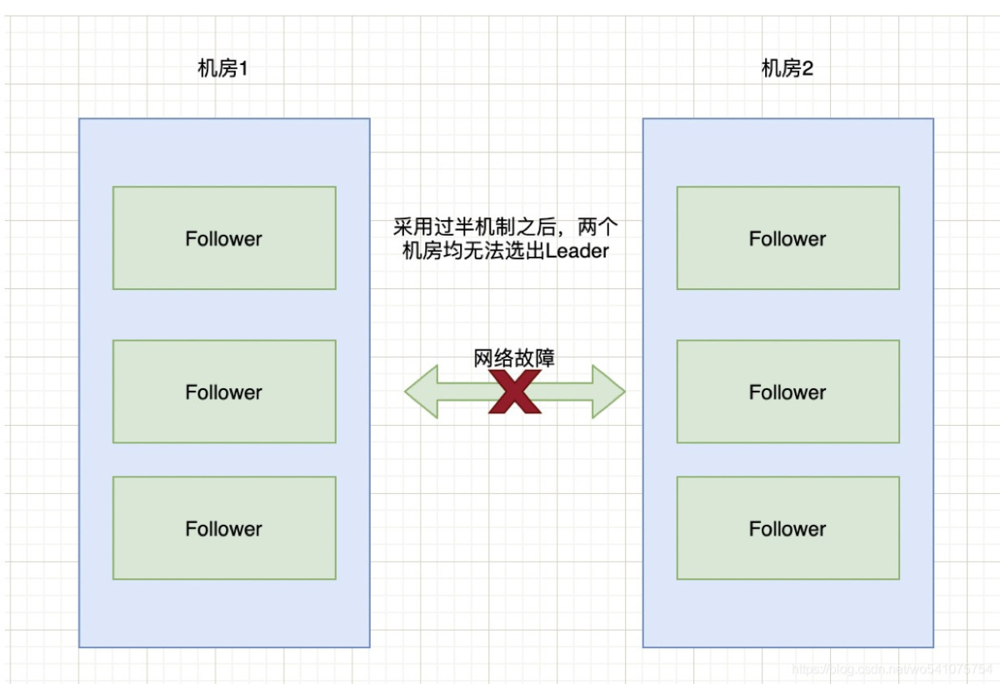
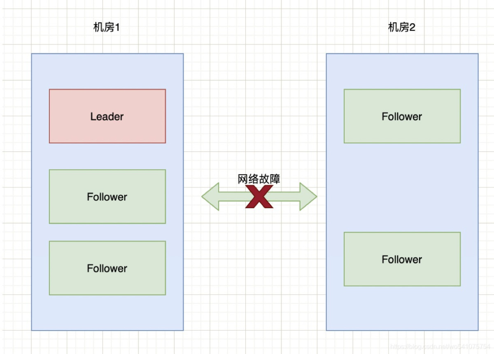
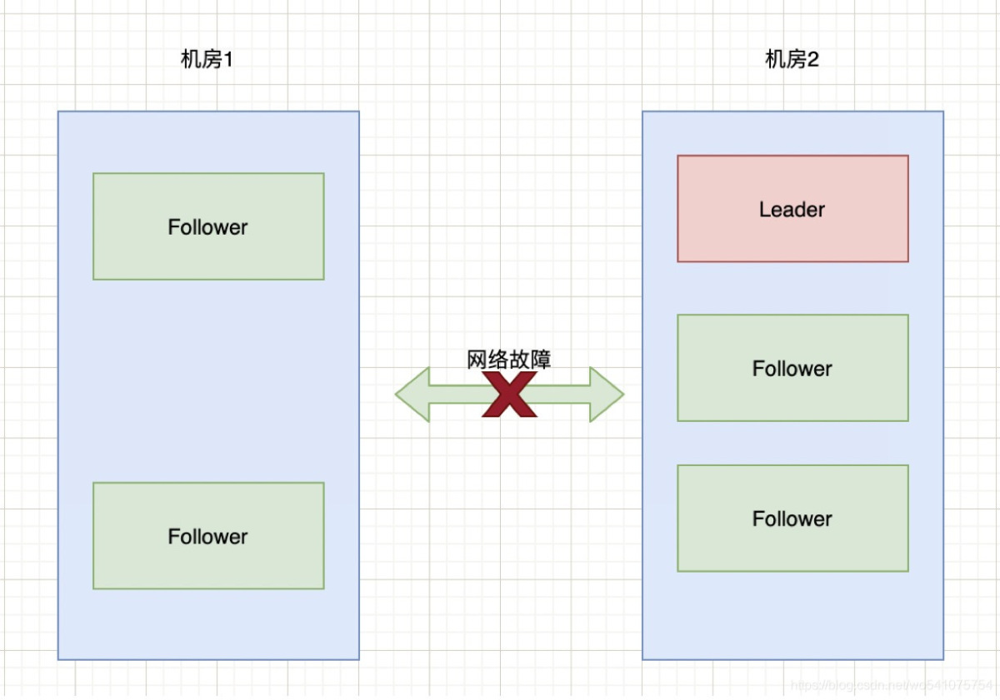

## 什么是脑裂？

在Elasticsearch、ZooKeeper这些集群环境中，有一个共同的特点，就是它们有一个“大脑”。比如，Elasticsearch集群中有Master节点，ZooKeeper集群中有Leader节点。

集群中的Master或Leader节点往往是通过选举产生的。在网络正常的情况下，可以顺利的选举出Leader（后续以Zookeeper命名为例）。但当两个机房之间的网络通信出现故障时，选举机制就有可能在不同的网络分区中选出两个Leader。当网络恢复时，这两个Leader该如何处理数据同步？又该听谁的？这也就出现了“脑裂”现象。

通俗的讲，脑裂(split-brain)就是“大脑分裂”，本来一个“大脑”被拆分成两个或多个。试想，如果一个人有多个大脑，且相互独立，就会导致人体“手舞足蹈”，“不听使唤”。

了解了脑裂的基本概念，下面就以zookeeper集群的场景为例，来分析一下脑裂的发生。

## zookeeper集群中的脑裂

我们在使用zookeeper时，很少遇到脑裂现象，是因为zookeeper已经采取了相应的措施来减少或避免脑裂的发生，这个后面会讲到Zookeeper的具体解决方案。现在呢，先假设zookeeper没有采取这些防止脑裂的措施。在这种情况下，看看脑裂问题是如何发生的。

现有6台zkServer服务组成了一个集群，部署在2个机房：



正常情况下，该集群只有会有个Leader，当Leader宕掉时，其他5个服务会重新选举出一个新的Leader。

如果机房1和机房2之间的网络出现故障，暂时不考虑Zookeeper的过半机制，那么就会出现下图的情况： 



也就是说机房2的三台服务检测到没有Leader了，于是开始重新选举，选举出一个新Leader来。原本一个集群，被分成了两个集群，同时出现了两个“大脑”，这就是所谓的“脑裂”现象。

由于原本的一个集群变成了两个，都对外提供服务。一段时间之后，两个集群之间的数据可能会变得不一致了。当网络恢复时，就面临着谁当Leader，数据怎么合并，数据冲突怎么解决等问题。

当然，上面的过程只是我们假设Zookeeper不做任何预防脑裂措施时会出现的问题。那么，针对脑裂问题，Zookeeper是如何进行处理的呢？

### Zookeeper的过半原则

防止脑裂的措施有多种，Zookeeper默认采用的是“过半原则”。所谓的过半原则就是：在Leader选举的过程中，如果某台zkServer获得了超过半数的选票，则此zkServer就可以成为Leader了。

底层源码实现如下：

```javascript
public class QuorumMaj implements QuorumVerifier {
 
    int half;
    
    // QuorumMaj构造方法。
    // 其中，参数n表示集群中zkServer的个数，不包括观察者节点
    public QuorumMaj(int n){
        this.half = n/2;
    }

    // 验证是否符合过半机制
    public boolean containsQuorum(Set<Long> set){
        // half是在构造方法里赋值的
        // set.size()表示某台zkServer获得的票数
        return (set.size() > half);
    }
}
```

上述代码在构建QuorumMaj对象时，传入了集群中有效节点的个数；containsQuorum方法提供了判断某台zkServer获得的票数是否超过半数，其中set.size表示某台zkServer获得的票数。

上述代码核心点两个：第一，如何计算半数；第二，投票属于半数的比较。

以上图6台[服务器](https://cloud.tencent.com/product/cvm?from=20065&from_column=20065)为例来进行说明：half = 6 / 2 = 3，也就是说选举的时候，要成为Leader至少要有4台机器投票才能够选举成功。那么，针对上面2个机房断网的情况，由于机房1和机房2都只有3台服务器，根本无法选举出Leader。这种情况下整个集群将没有Leader。



在没有Leader的情况下，会导致Zookeeper无法对外提供服务，所以在设计的时候，我们在集群搭建的时候，要避免这种情况的出现。

如果两个机房的部署请求部署3：3这种状况，而是3：2，也就是机房1中三台服务器，机房2中两台服务器： 



在上述情况下，先计算half = 5 / 2 = 2，也就是需要大于2台机器才能选举出Leader。那么此时，对于机房1可以正常选举出Leader。对于机房2来说，由于只有2台服务器，则无法选出Leader。此时整个集群只有一个Leader。

对于上图，颠倒过来也一样，比如机房1只有2台服务器，机房2有三台服务器，当网络断开时，选举情况如下： 



Zookeeper集群通过过半机制，达到了要么没有Leader，要没只有1个Leader，这样就避免了脑裂问题。

对于过半机制除了能够防止脑裂，还可以实现快速的选举。因为过半机制不需要等待所有zkServer都投了同一个zkServer就可以选举出一个Leader，所以也叫快速领导者选举算法。

## 新旧Leader争夺

通过过半原则可以防止机房分区时导致脑裂现象，但还有一种情况就是Leader假死。

假设某个Leader假死，其余的followers选举出了一个新的Leader。这时，旧的Leader复活并且仍然认为自己是Leader，向其他followers发出写请求也是会被拒绝的。

因为ZooKeeper维护了一个叫epoch的变量，每当新Leader产生时，会生成一个epoch标号（标识当前属于那个Leader的统治时期），epoch是递增的，followers如果确认了新的Leader存在，知道其epoch，就会拒绝epoch小于现任leader epoch的所有请求。

那有没有follower不知道新的Leader存在呢，有可能，但肯定不是大多数，否则新Leader无法产生。ZooKeeper的写也遵循quorum机制，因此，得不到大多数支持的写是无效的，旧leader即使各种认为自己是Leader，依然没有什么作用。

## ZooKeeper集群节点为什么要部署成奇数

上面讲了过半原则，由于Zookeeper默认采用的就是这种策略，那就带来另外一个问题。集群的数量设置为多少合适呢？而我们所看到的Zookeeper节点数一般都是奇数，这是为什么呢？

首先，只要集群中有过半的机器是正常工作的，那么整个集群就可对外服务。那么我们列举一些情况，来看看在这些情况下集群的容错性。

如果有2个节点，那么只要挂掉1个节点，集群就不可用了。此时，集群对的容忍度为0；

如果有3个节点，那么挂掉1个节点，还有剩下2个正常节点，超过半数，可以重新选举，正常服务。此时，集群的容忍度为1；

如果有4个节点，那么挂掉1个节点，剩下3个，超过半数，可以重新选举。但如果再挂掉1个，只剩下2个，就无法正常选举和服务了。此时，集群的容忍度为1；

依次类推，5个节点，容忍度为2；6个节点容忍度同样为2；

既然3个节点和4个节点、5个节点和6个节点，也就是2n和2n-1的容忍度是一样的，都是n-1。那么，为了节省资源，为了更加高效（更多节点参与选举和通信），为什么不少一个节点呢？这就是为什么集群要部署成奇数的原因。

## 解决脑裂的常见方法

上面提到了Zookeeper使用的过半原则，这里再把解决脑裂问题的场景方式总结一下。

### 方法一，Quorums（法定人数）方式

比如3个节点的集群，Quorums = 2，也就是说集群可以容忍1个节点失效，这时候还能选举出1个lead，集群还可用。比如4个节点的集群，它的Quorums = 3，Quorums要超过3，相当于集群的容忍度还是1，如果2个节点失效，那么整个集群还是无效的。这是ZooKeeper防止“脑裂”默认采用的方法。

### 方法二，添加心跳线

集群中采用多种通信方式，防止一种通信方式失效导致集群中的节点无法通信。

比如，添加心跳线。原来只有一条心跳线路，此时若断开，则接收不到心跳报告，判断对方已经死亡。若有2条心跳线路，一条断开，另一条仍然能够接收心跳报告，能保证集群服务正常运行。心跳线路之间也可以 HA（高可用），这两条心跳线路之间也可以互相检测，若一条断开，则另一条马上起作用。正常情况下，则不起作用，节约资源。

### 方法三，启动磁盘锁定方式。

使用磁盘锁的形式，保证集群中只能有一个Leader获取磁盘锁，对外提供服务，避免数据错乱发生。但是，也会存在一个问题，若该Leader节点宕机，则不能主动释放锁，那么其他的Follower就永远获取不了共享资源。于是有人在HA中设计了"智能"锁。正在服务的一方只有在发现心跳线全部断开（察觉不到对端）时才启用磁盘锁。平时就不上锁了

### 方法四，仲裁机制方式。

脑裂导致的后果是从节点不知道该连接哪一台Leader，此时有一个仲裁方就可以解决此问题。比如提供一个参考的IP地址，心跳机制断开时，节点各自ping一下参考IP，如果ping不通，那么表示该节点网络已经出现问题，则该节点需要自行退出争抢资源，释放占有的共享资源，将服务的提供功能让给功能更全面的节点。

---

以上方式可以同时使用，可以减少集群中脑裂情况的发生，但不能完全保证，比如仲裁机制中2台机器同时宕机，那么此时集群中没有Leader 可以使用。此时就需要人工干预了。